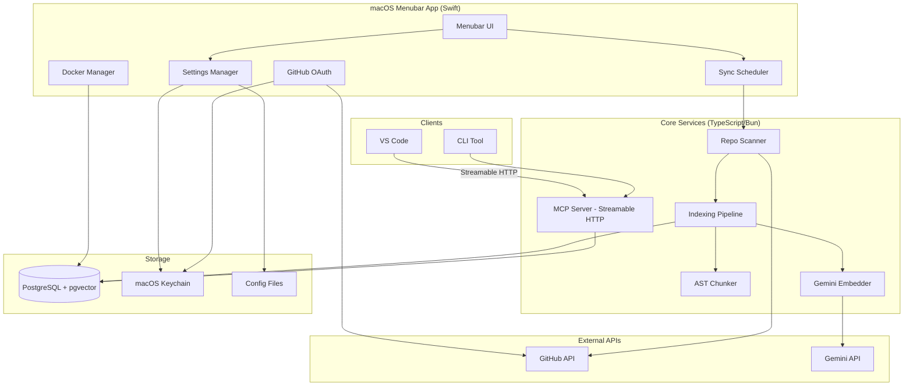
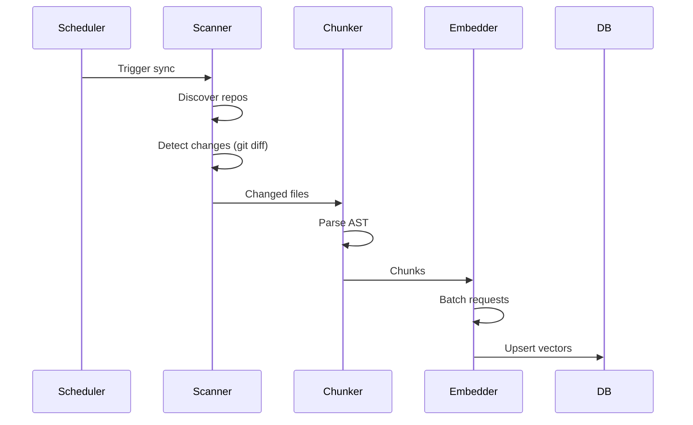
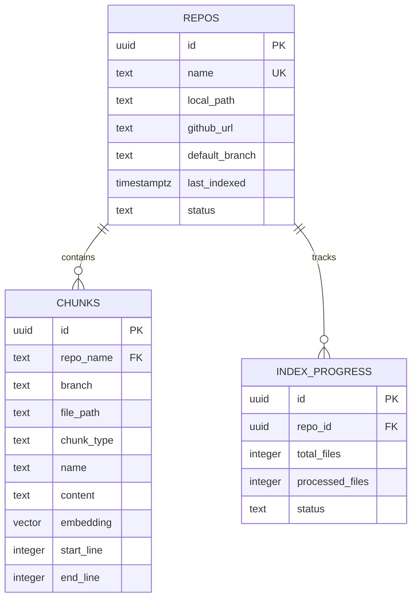
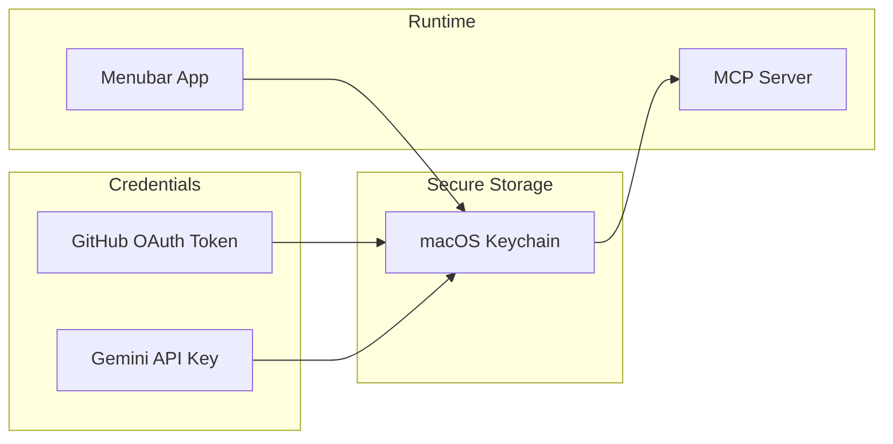

# LionMCP Architecture

> System design and component relationships for the LionMCP project.

## High-Level Architecture



## Component Details

### 1. macOS Menubar App (`apps/menubar/`)

**Responsibilities**:
- Manage Docker container lifecycle (PostgreSQL)
- Handle GitHub OAuth flow
- Store credentials in Keychain
- Schedule periodic syncs
- Provide settings UI

**Technologies**:
- Swift 5.9 + SwiftUI
- `MenuBarExtra` for menubar presence
- `GCDWebServer` for OAuth callback
- `KeychainAccess` for secure storage

**Key Files**:
```
apps/menubar/
├── Sources/
│   ├── LionMCPApp.swift           # App entry point
│   ├── MenuBar/
│   │   ├── MenuBarView.swift      # Main menubar UI
│   │   └── StatusIndicator.swift  # Sync status display
│   ├── Docker/
│   │   └── DockerManager.swift    # Docker CLI wrapper
│   ├── OAuth/
│   │   └── GitHubOAuth.swift      # OAuth flow handler
│   ├── Settings/
│   │   └── SettingsView.swift     # Settings window
│   └── Sync/
│       └── SyncScheduler.swift    # Polling scheduler
└── Package.swift
```

### 2. MCP Server (`packages/mcp-server/`)

**Responsibilities**:
- Expose MCP tools via Streamable HTTP transport
- Handle semantic search queries
- Coordinate with database and chunker

**Technologies**:
- TypeScript + Bun
- `@modelcontextprotocol/sdk` for MCP protocol
- Express.js for HTTP server (POST + SSE)

**Key Files**:
```
packages/mcp-server/
├── src/
│   ├── index.ts                   # Server entry point
│   ├── transport/
│   │   └── streamable-http.ts    # Streamable HTTP transport
│   └── tools/
│       ├── search-code.ts         # search_code tool
│       ├── find-symbol.ts         # find_symbol tool
│       ├── get-file-context.ts    # get_file_context tool
│       ├── get-ast-outline.ts     # get_ast_outline tool
│       └── ...
└── package.json
```

### 3. Indexing Pipeline (`packages/embeddings/`)

**Responsibilities**:
- Orchestrate full and incremental indexing
- Generate embeddings via Gemini API
- Manage rate limiting and batching

**Flow**:


### 4. Code Chunker (`packages/chunker/`)

**Responsibilities**:
- Parse source code into AST
- Extract semantic chunks (functions, classes)
- Support multiple languages

**Supported Languages**:
| Language | Parser | Chunk Types |
|----------|--------|-------------|
| TypeScript | tree-sitter-typescript | function, class, method, export |
| JavaScript | tree-sitter-javascript | function, class, method, export |
| Kotlin | tree-sitter-kotlin | fun, class, object, interface |
| Java | tree-sitter-java | method, class, interface |
| Go | tree-sitter-go | func, type, interface |
| Markdown | Custom | section (by ##) |

### 5. Database Layer (`packages/db/`)

**Responsibilities**:
- Manage PostgreSQL connection pool
- Execute vector similarity queries
- Handle schema migrations

**Schema Overview**:


## Data Flow

### Indexing Flow (Write Path)

1. **Scheduler** triggers sync (hourly or manual)
2. **Scanner** discovers repos and detects changes via `git diff`
3. **Chunker** parses changed files into semantic chunks
4. **Embedder** calls Gemini API in batches of 100
5. **Database** upserts vectors and deletes stale entries

### Query Flow (Read Path)

1. **Client** (VS Code/CLI) sends request via Streamable HTTP
2. **MCP Server** parses tool call and arguments
3. **Database** executes vector similarity search with filters
4. **MCP Server** formats and returns results

## Security Architecture



**Security Measures**:
- OAuth tokens stored in macOS Keychain (with iCloud sync option)
- API keys never logged or embedded in code
- PostgreSQL accessible only via localhost
- Sensitive files excluded from indexing by default

## Deployment Options

### Local (Current Focus)

```
┌─────────────────────────────────────────┐
│               macOS                      │
│  ┌─────────┐  ┌─────────┐  ┌─────────┐  │
│  │Menubar  │  │  MCP    │  │PostgreSQL│  │
│  │  App    │──│ Server  │──│ (Docker) │  │
│  └─────────┘  └─────────┘  └─────────┘  │
└─────────────────────────────────────────┘
```

### Remote (Future)

```
┌─────────────────┐      ┌─────────────────────────┐
│    Developer    │      │        Railway          │
│  ┌───────────┐  │      │  ┌──────┐  ┌─────────┐ │
│  │  VS Code  │──┼─HTTP─┼──│ MCP  │──│ Neon    │ │
│  └───────────┘  │      │  │Server│  │Postgres │ │
│                 │      │  └──────┘  └─────────┘ │
└─────────────────┘      └─────────────────────────┘
```

## Performance Considerations

| Component | Bottleneck | Mitigation |
|-----------|------------|------------|
| Embedding | API rate limit (1500 RPM) | Batch requests, queue management |
| Vector Search | Large dataset (100K+ vectors) | IVFFlat index, HNSW future option |
| File Scanning | 20K+ files | Parallel processing, incremental diff |
| Docker | Startup time | Keep container running, auto-restart |

## Extensibility Points

1. **New Languages**: Add tree-sitter grammar to `packages/chunker/src/parsers/`
2. **New MCP Tools**: Implement in `packages/mcp-server/src/tools/`
3. **New Embedding Providers**: Abstract interface in `packages/embeddings/src/providers/`
4. **Custom Filters**: Add to `packages/db/src/queries/`
