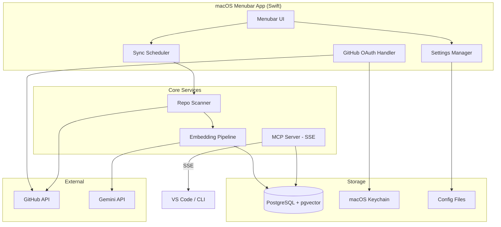
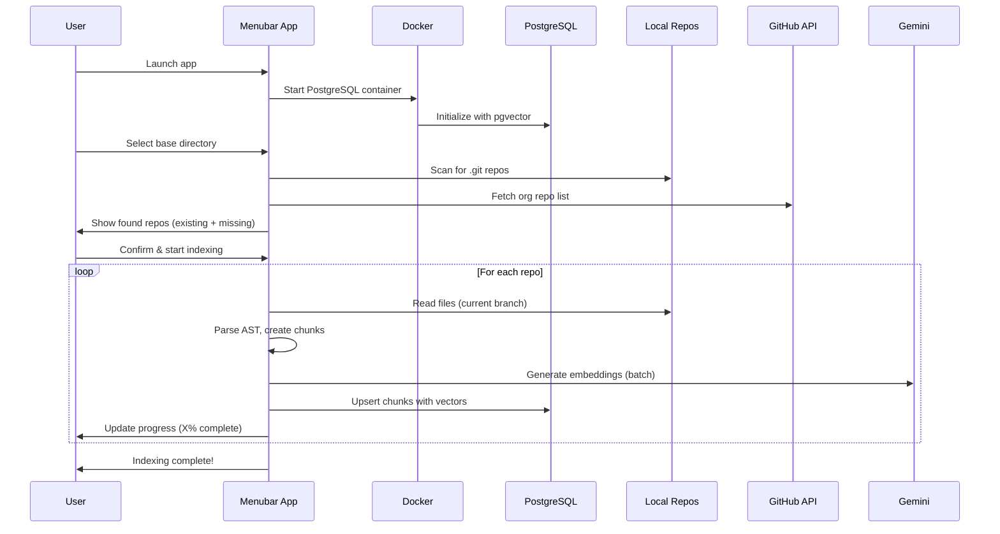
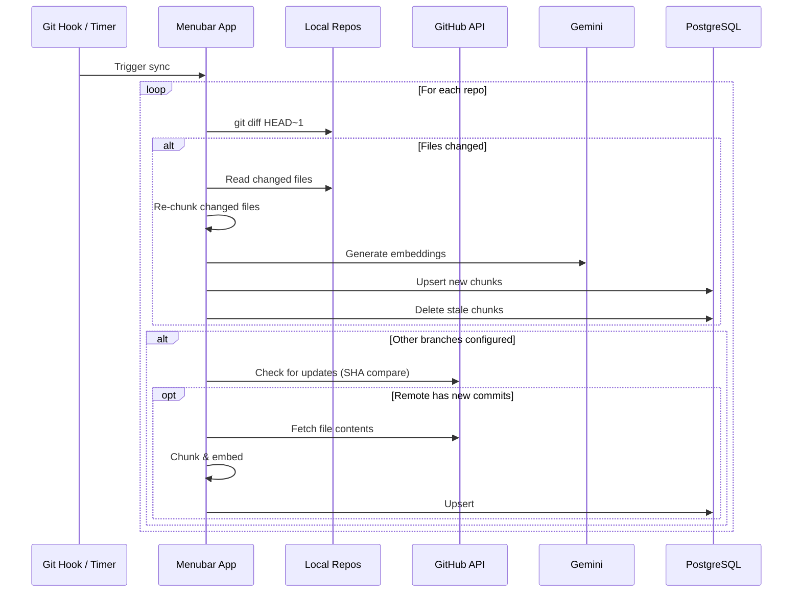

# LionMCP: Local MCP Server for Lion Parcel Microservices

> A macOS menubar application that provides semantic code search across all Lion Parcel repositories via Model Context Protocol (MCP) with SSE transport.

## Executive Summary

LionMCP is a developer productivity tool that:
1. **Indexes** all Lion Parcel microservices into a local PostgreSQL + pgvector database
2. **Exposes** semantic search capabilities via MCP server (SSE transport)
3. **Syncs** automatically with GitHub using OAuth authentication
4. **Runs** as a native macOS menubar app with Docker-managed PostgreSQL

---

## Architecture Overview



---

## Components

### 1. macOS Menubar App (Swift/AppKit)

#### Features
- Native macOS app with menubar presence
- Docker lifecycle management for PostgreSQL
- Background sync with progress indicators
- Settings UI for configuration

#### Menubar Display
- Last sync time per repo
- Number of indexed files/chunks
- Sync in progress indicator (% complete)
- Error states with actionable messages
- Quick actions: Manual sync, Open settings, View logs

#### Settings Panel
| Setting | Type | Description |
|---------|------|-------------|
| GitHub OAuth | Button | One-click OAuth flow |
| Gemini API Key | SecureField | BYOK for embeddings |
| Base Directories | List | Paths to scan for repos |
| Branch Defaults | List | `main, master, staging, stg, development, dev` |
| Sensitive Patterns | List | Files to exclude (e.g., `.env`, `**/secrets/**`) |
| Polling Interval | Picker | Hourly (default), Manual only |
| Debug Mode | Toggle | Enable verbose file logging |

### 2. GitHub Integration

#### Authentication
- **Method**: OAuth App with localhost redirect
- **Flow**:
  1. User clicks "Login with GitHub" in menubar
  2. Opens `https://github.com/login/oauth/authorize`
  3. GitHub redirects to `http://localhost:19847/callback`
  4. App receives token, stores in macOS Keychain (iCloud Keychain enabled for multi-Mac sync)
- **Scopes Required**: `repo` (read access to private repos)

#### Repo Discovery Flow
1. User selects base directory(s) (e.g., `/Users/lion/Documents/DEVELOPMENTS/lionparcel`)
2. App recursively scans for `.git` directories
3. Compares with GitHub org repos (if authenticated)
4. **Existing local repos**: Index immediately using local files
5. **Missing repos**: Offer to clone to `~/Library/Application Support/LionMCP/repos/`

#### Branch Strategy (Hybrid)
- **Primary**: Index currently checked-out branch (local files, fast)
- **Secondary**: Fetch other configured branches via GitHub API (lazy, on-demand)
- **Priority Order**: User's current branch > configured defaults
- **Defaults**: `main`, `master`, `staging`, `stg`, `development`, `dev`
- **Per-repo overrides**: Configurable in settings

#### Polling & Sync
- **Trigger**: Hourly scheduled + manual button + local git hooks
- **Git Hooks**: Install `post-merge`, `post-checkout` hooks in each repo
- **Lightweight Check**: Compare local HEAD SHA with remote (1 API call/repo)
- **Incremental Update**: Only re-index changed files via `git diff`

### 3. Embedding Pipeline

#### Technology Stack
- **Embedding Model**: Gemini `text-embedding-004` (768 dimensions)
- **API-based**: Requires internet, ~$0.00001/1K tokens
- **Batch Processing**: 100 chunks per API call for efficiency

#### Chunking Strategy (AST-Aware)
| File Type | Chunking Method |
|-----------|-----------------|
| TypeScript/JavaScript | Extract functions, classes, exports as separate chunks |
| Kotlin/Java | Extract methods, classes, interfaces |
| Go | Extract functions, structs, interfaces |
| Markdown | Split by headers (##), keep code blocks intact |
| Other | Sliding window (1000 chars, 200 overlap) |

#### Indexed Content Types
- Source code (AST-parsed)
- Function signatures (separate index for API discovery)
- Docstrings/comments (separate searchable chunks)
- Documentation files (`.md`, `README`, `AGENTS.md`, `ARCHITECTURE.md`)
- Rules files (`.rules`, `CLAUDE.md`, etc.)

#### Metadata per Chunk
```typescript
interface ChunkMetadata {
  // Identity
  id: string;                    // UUID
  repoName: string;              // e.g., "hydra"
  branch: string;                // e.g., "main"
  filePath: string;              // relative path

  // Semantic
  chunkType: 'function' | 'class' | 'method' | 'export' | 'section' | 'comment' | 'file';
  name: string;                  // function/class name
  signature?: string;            // for API discovery
  language: string;              // e.g., "kotlin", "typescript"

  // Position
  startLine: number;
  endLine: number;

  // Git
  lastModified: string;          // ISO date
  commitSha: string;

  // Search
  imports: string[];             // dependencies
  exports: string[];             // what this exports
}
```

### 4. Vector Database (PostgreSQL + pgvector)

#### Setup
- **Docker Image**: `pgvector/pgvector:pg16`
- **Managed by**: Menubar app (lifecycle tied to app)
- **Data Location**: `~/Library/Application Support/LionMCP/pgdata`
- **Port**: 5433 (non-standard to avoid conflicts)

#### Schema
```sql
CREATE EXTENSION IF NOT EXISTS vector;

CREATE TABLE chunks (
  id UUID PRIMARY KEY DEFAULT gen_random_uuid(),
  repo_name TEXT NOT NULL,
  branch TEXT NOT NULL,
  file_path TEXT NOT NULL,
  chunk_type TEXT NOT NULL,
  name TEXT,
  signature TEXT,
  language TEXT,
  start_line INTEGER,
  end_line INTEGER,
  content TEXT NOT NULL,
  -- Multi-vector strategy: logic + intent embeddings
  embedding vector(768) NOT NULL,        -- Code logic/structure vector
  intent_embedding vector(768),          -- Docstring/comment intent vector (nullable)
  imports TEXT[],
  exports TEXT[],
  last_modified TIMESTAMPTZ,
  commit_sha TEXT,
  created_at TIMESTAMPTZ DEFAULT NOW(),
  updated_at TIMESTAMPTZ DEFAULT NOW()
);

-- Indexes for efficient queries
CREATE INDEX idx_chunks_repo ON chunks(repo_name);
CREATE INDEX idx_chunks_branch ON chunks(repo_name, branch);
CREATE INDEX idx_chunks_language ON chunks(language);
CREATE INDEX idx_chunks_type ON chunks(chunk_type);
CREATE INDEX idx_chunks_name ON chunks(name) WHERE name IS NOT NULL;

-- Vector similarity indexes (IVFFlat for 100K+ vectors)
CREATE INDEX idx_chunks_embedding ON chunks
  USING ivfflat (embedding vector_cosine_ops)
  WITH (lists = 100);
CREATE INDEX idx_chunks_intent ON chunks
  USING ivfflat (intent_embedding vector_cosine_ops)
  WITH (lists = 100)
  WHERE intent_embedding IS NOT NULL;

-- Full-text search index for hybrid search (RRF)
CREATE INDEX idx_chunks_content_fts ON chunks
  USING gin(to_tsvector('english', content));
```

#### Query Capabilities
- **Semantic Search**: Cosine similarity on `embedding` vector
- **Intent Search**: Cosine similarity on `intent_embedding` for natural language queries
- **Hybrid Search (RRF)**: Reciprocal Rank Fusion combining:
  - Vector similarity scores
  - Full-text search (GIN index) for exact IDs/names
  - Final score: `1/(k + rank_vector) + 1/(k + rank_fts)` where k=60
- **Metadata Filtering**: By repo, branch, language, chunk_type
- **Similarity Thresholds**: Configurable minimum score (default: 0.7)

### 5. MCP Server (SSE Transport)

#### Transport
- **Protocol**: Streamable HTTP (2026 Standard)
- **Endpoint**: `http://localhost:19848/mcp`
- **Client→Server**: HTTP POST requests
- **Server→Client**: Server-Sent Events (SSE) for streaming
- **Rationale**: Zero migration effort for remote deployment, serverless-compatible

#### Tools Exposed

```typescript
// Semantic code search across repos
search_code(
  query: string,
  filters?: {
    repos?: string[];
    branches?: string[];
    languages?: string[];
    chunkTypes?: string[];
    minScore?: number;
  },
  limit?: number = 10
): SearchResult[]

// Find symbol definitions and usages
find_symbol(
  name: string,
  type?: 'function' | 'class' | 'method' | 'export'
): SymbolResult[]

// List directory contents with metadata
list_directory(
  path: string,
  repo: string
): DirectoryEntry[]

// Get file content with context
get_file_context(
  path: string,
  repo: string,
  lineRange?: { start: number; end: number }
): FileContext

// Get AST outline of a file
get_ast_outline(
  path: string,
  repo: string
): ASTOutline

// Read multiple files at once
read_multiple_files(
  paths: Array<{ repo: string; path: string }>
): FileContent[]

// Find all references to a symbol
find_references(
  symbol: string,
  scope?: 'repo' | 'all'
): ReferenceResult[]

// Get import/export dependency graph
get_dependency_graph(
  path: string,
  repo: string,
  depth?: number = 2
): DependencyGraph

// AI-powered code explanation
explain_logic(
  path: string,
  repo: string,
  lineRange?: { start: number; end: number }
): Explanation

// List all indexed repos with status
list_repos(): RepoStatus[]

// Get documentation files
get_documentation(
  repo: string,
  type?: 'readme' | 'agents' | 'architecture' | 'all'
): Documentation[]
```

#### Response Format
- Code snippets with file paths and line numbers
- Metadata included (repo, branch, language)
- Similarity scores for search results

### 6. Clients

#### VS Code Extension
- Connects to local MCP server via SSE
- Configuration in `.vscode/mcp_config.json` or global settings
- Uses existing MCP host infrastructure

#### CLI Tool
```bash
# Install
brew install lionmcp-cli

# Usage
lionmcp search "payment validation logic"
lionmcp find-symbol AuthService --type class
lionmcp explain ./src/payment/handler.ts:45-60
lionmcp status  # Show sync status
```

---

## Data Flow

### Initial Indexing (First Run)


### Incremental Sync


---

## Storage & Performance

### Expected Scale
| Metric | Estimate |
|--------|----------|
| Total files | 20,000+ |
| Avg chunks per file | ~5 |
| Total chunks | ~100,000 |
| Embedding dimensions | 768 |
| Vector storage | ~300MB |
| Metadata storage | ~500MB |
| Total PostgreSQL | ~2-3GB |

### Initial Indexing Time
- **API calls**: ~100K chunks × 1 call/100 chunks = 1,000 API calls
- **Rate limit**: Gemini allows 1,500 RPM
- **Estimated time**: 3-6 hours (background, non-blocking)

### Query Performance
- Semantic search: < 100ms (with IVFFlat index)
- Filtered search: < 50ms
- Symbol lookup: < 20ms

---

## Security

### Credential Storage
- GitHub OAuth token: macOS Keychain (iCloud Keychain for sync)
- Gemini API key: macOS Keychain
- PostgreSQL: Local socket, no password (Docker internal)

### Sensitive File Handling
- User-configurable exclusion patterns
- Defaults: `.env*`, `**/secrets/**`, `**/*.pem`, `**/*.key`
- Files matching `.gitignore` excluded by default
- Option to include gitignored files with warning

### Data Locality
- All data stored locally in `~/Library/Application Support/LionMCP/`
- No external transmission except:
  - GitHub API (repo metadata, file contents for non-local branches)
  - Gemini API (code chunks for embedding)

---

## Error Handling

### Crash Recovery
- Indexing progress checkpointed every 100 files
- On crash: Mark repo as "partial", prompt user to resume or restart
- Partial indexes are searchable but marked in results

### Network Failures
- GitHub: Retry with exponential backoff (3 attempts)
- Gemini: Queue failed chunks, retry on next sync
- Offline mode: Search existing index, skip sync

### Docker Issues
- Container health check every 30s
- Auto-restart on failure (max 3 attempts)
- Manual recovery option in menubar

---

## Logging & Debugging

### Log Levels
- **Error**: Always logged, shown in menubar
- **Warn**: Logged to file, summarized in menubar
- **Info**: Logged when debug mode enabled
- **Debug**: Full verbose logs in debug mode

### Log Location
- `~/Library/Logs/LionMCP/app.log`
- `~/Library/Logs/LionMCP/mcp-server.log`
- `~/Library/Logs/LionMCP/indexer.log`

### Debug Mode Features
- Full request/response logging for MCP
- Timing metrics for indexing operations
- SQL query logging

---

## Installation & Setup

### Prerequisites
- macOS 13+ (Ventura or later)
- Docker Desktop installed
- Gemini API key

### First Launch
1. Download LionMCP.app from releases
2. Move to Applications folder
3. Launch app (appears in menubar)
4. Click menubar icon → Settings
5. Enter Gemini API key
6. Click "Login with GitHub" → Authorize
7. Add base directory (e.g., `/Users/you/Development/lionparcel`)
8. Click "Start Initial Index"
9. Wait for completion (3-6 hours, runs in background)

### VS Code Setup
```json
// .vscode/settings.json or global settings
{
  "mcp.servers": {
    "lionmcp": {
      "transport": "sse",
      "url": "http://localhost:19848/sse"
    }
  }
}
```

---

## Future Considerations

### Remote Migration Path
1. Deploy MCP server to Railway/Cloud Run
2. Move PostgreSQL to managed service (Supabase, Neon)
3. Update client config to point to remote URL
4. SSE transport remains unchanged

### Potential Enhancements
- [ ] Web UI for search (React dashboard)
- [ ] Team shared index (central server)
- [ ] PR diff analysis (what changed semantically)
- [ ] Code review suggestions based on similar patterns
- [ ] Integration with Jira for context linking

---

## Technical Decisions Summary

| Decision | Choice | Rationale |
|----------|--------|-----------|
| Menubar Framework | Swift/AppKit | Native, lightweight, best macOS UX |
| Vector DB | PostgreSQL + pgvector | SQL familiarity, Docker manageable, production-ready |
| Embedding Model | Gemini text-embedding-004 | High quality, reasonable cost, easy API |
| MCP Transport | Streamable HTTP | 2026 standard, serverless-ready, zero migration for remote |
| GitHub Auth | OAuth App | Best UX (one-click), no PAT management |
| Branch Strategy | Hybrid (local + API fallback) | Non-invasive, flexible |
| Chunking | AST-aware | Semantic code understanding |
